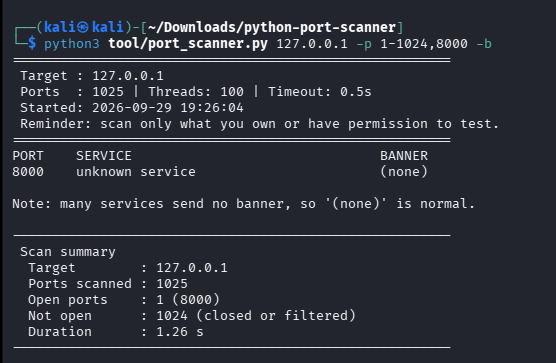

# Simple Python Port Scanner for Beginners

A small, beginner-friendly TCP port scanner written in Python using only the standard library. It checks which ports are open on a target, names the service usually found on each open port, and can optionally read a short banner. It is a learning project, not a replacement for professional tools such as Nmap.

> **Authorized use only.** Scan only systems you own or have explicit, written permission to test. Permission to use a network or website is not permission to scan it. Safe practice targets: your own machine (`127.0.0.1`), devices on your own home network, or `scanme.nmap.org` (keep scans small and gentle). Unauthorized scanning may be illegal and can trigger security alerts.

## What it does
- Tries a TCP connection to each requested port and reports which are open
- Names the usual service for each open port (e.g. 22 = SSH, 443 = HTTPS)
- Optionally reads a banner from open ports (`-b`)
- Prints a scan summary: target, resolved address, ports scanned, open ports, and duration
- Stops with a plain-English message on bad input instead of a Python traceback

## How it works
It performs a **TCP connect scan**: for every port it attempts a normal TCP connection. If the connection succeeds, the port is open. If it is refused or times out, the port is *closed or filtered* - the scanner cannot tell which. Scanning is done in parallel using a thread pool. It sends no exploits and does not try to evade firewalls.

## Install
Requires Python 3.8 or newer. There is nothing else to install.

```bash
git clone https://github.com/abdulqayumakindele/python-port-scanner.git
cd python-port-scanner
python3 tool/port_scanner.py 127.0.0.1
```

## Usage
```bash
python3 tool/port_scanner.py TARGET [-p PORTS] [-t THREADS] [--timeout SECONDS] [-b]
```

| Option | Meaning | Default |
|---|---|---|
| `-p, --ports` | A port, list, range, or a mix: `80`, `22,80,443`, `1-1024`, `22,80,100-200` (valid ports: 1-65535) | `1-1024` |
| `-t, --threads` | Parallel threads, 1-1000 | `100` |
| `--timeout` | Seconds to wait per port; must be greater than 0 | `0.5` |
| `-b, --banner` | Try to read a banner from open ports | off |

### Examples
```bash
python3 tool/port_scanner.py 127.0.0.1
python3 tool/port_scanner.py 127.0.0.1 -p 22,80,443
python3 tool/port_scanner.py scanme.nmap.org -p 20-100 -b
python3 tool/port_scanner.py 192.168.1.1 -p 22,80,100-200 -t 50 --timeout 1
```

### Input errors
Bad input is reported clearly and nothing is scanned. For example:

```text
error: argument -p/--ports: The range '1000-100' is backwards. Write it as 100-1000.
error: argument -t/--threads: Threads must be at least 1.
[!] Could not resolve 'nohost.invalid'. Check the spelling and your internet connection. Note: this scanner supports IPv4 only.
```

## Example output
Sample output from a scan of two local test servers on `127.0.0.1` (one sends a banner, one stays silent). Your results will differ.

```text
=======================================================
 Target : 127.0.0.1
 Ports  : 3 | Threads: 100 | Timeout: 0.5s
 Started: 2026-09-28 23:20:16
 Reminder: scan only what you own or have permission to test.
=======================================================
PORT    SERVICE                               BANNER
2525    unknown service                       220 demo service ready
8765    unknown service                       (none)

Note: many services send no banner, so '(none)' is normal.

-------------------------------------------------------
 Scan summary
  Target        : 127.0.0.1
  Ports scanned : 3
  Open ports    : 2 (2525, 8765)
  Not open      : 1 (closed or filtered)
  Duration      : 1.00 s
-------------------------------------------------------
```



## About banner grabbing
- Banner reading is **passive**: after a port opens, the scanner waits up to one second and reads whatever the service sends first. It never sends data itself.
- **Many services send no banner.** Web servers (HTTP/HTTPS) are the common example - they wait for a request first - so `(none)` is normal and does not mean the port is closed.
- Banners are shortened, cleaned of control characters, and may be missing, generic or misleading. Treat them as a hint, not proof.
- Banner reading only adds waiting time on ports that are already open.

## Limitations
- TCP connect scan only - no UDP, no stealth or half-open scans
- IPv4 only
- Firewalls can hide open ports; "closed or filtered" cannot tell the two apart
- Service names are guessed from the port number, not by inspecting the service
- Not a vulnerability scanner
- Speed depends on your network, timeout and thread count

## Tests
```bash
python3 -m unittest discover -s tests -v
```
The tests cover port parsing, input validation, service names, banner handling, error messages, and scanning of `127.0.0.1` using throwaway local servers. No internet connection is needed.

## Project website (Astro)
This repo also contains a small Astro site documenting the tool, built with the same structure as my portfolio (central data file, shared layout, header/footer, one global stylesheet).

```bash
npm install
npm run dev      # local site
npm run build    # production build in dist/
```

Site content lives in `src/data/content.js`. The scanner in `tool/port_scanner.py` is shown on the Source Code page automatically.

## Structure
```text
tool/port_scanner.py      the scanner
tests/                    unit tests (standard library only)
src/data/content.js       all site content
src/pages/                index, how-it-works, usage, code, ethics
src/components/           Header, Footer
src/layouts/Layout.astro  shared layout
src/styles/global.css     theme
```

## Responsible use
You are responsible for how you use this tool. It is provided for education and authorized testing only, with no warranty.

Author: Abdul Qayum Akindele
